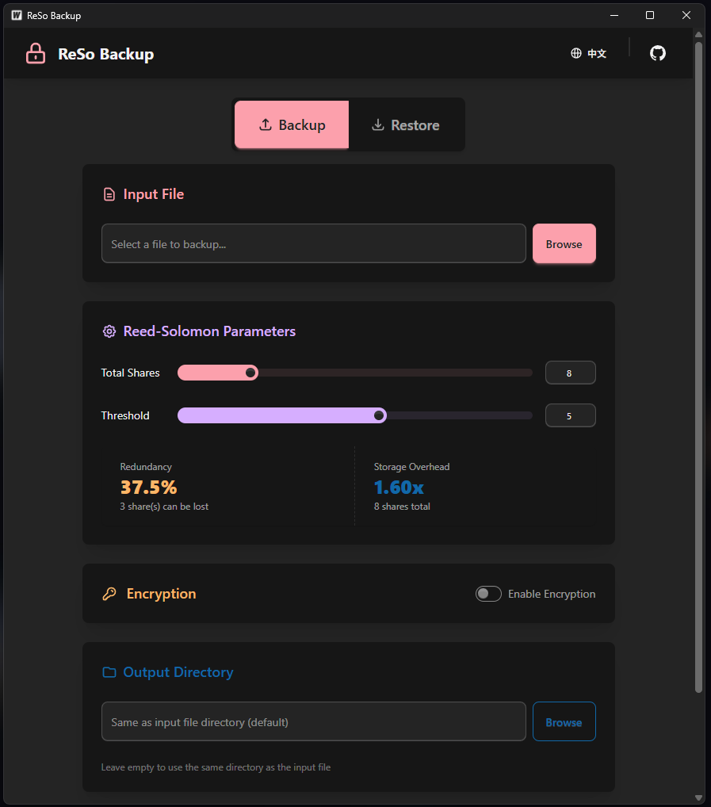

<p align="center">
  
</p>

<h1 align="center">ReSo Backup</h1>

<p align="center">
  English | <a href="README.md">中文</a>
</p>

<p align="center">
  An encrypted backup tool powered by Reed-Solomon erasure coding — split files into shards, scatter them across locations, and recover even when some are lost
</p>

<p align="center">
  <a href="#how-it-works">How It Works</a> · <a href="#use-case">Use Case</a> · <a href="#quick-start">Quick Start</a> · <a href="#gui-mode">GUI</a> · <a href="#cli-mode">CLI</a> · <a href="#building">Building</a>
</p>

---

## Preview

<p align="center">
  
</p>

## How It Works

ReSo Backup uses **Reed-Solomon erasure coding** to split a file into N shards with built-in redundancy. You can recover the original file from **any K** of those N shards (K ≤ N).

Think of it like this:

> A jigsaw puzzle is split into N pieces. Each piece alone tells you nothing about the full picture. But as long as you have any K pieces, you can reconstruct the entire puzzle — even if the other N − K pieces are gone forever.

The backup process:

```
Original File
   │
   ▼
[Optional] AES-256-GCM encryption (encrypts file content and filename with your password)
   │
   ▼
Reed-Solomon encoding (split into N shards, any K can recover)
   │
   ▼
Output: 1 metadata file (.rsmeta) + N shard files (.rs.001 ~ .rs.N)
```

**To restore**, just provide any single shard file (or the `.rsmeta` metadata file). The program automatically discovers all shards in the same group, and once K shards are available, the file is fully restored.

### Two Key Parameters

| Parameter | Meaning |
|-----------|---------|
| **Shares** | Total number of shards the file is split into |
| **Threshold** | Minimum number of shards needed to recover |

Shares − Threshold = number of shards you can afford to lose.

## Use Case

Suppose you want to back up an important file with these guarantees:

- **No single cloud provider** can see your file content
- **Local data alone** is not enough to reconstruct the file
- **Any single storage failure** won't prevent recovery

### Recommended Setup: 5 Shares, Threshold 3

Set shares = **5**, threshold = **3**:

```bash
rsbackup backup --input important.docx --shares 5 --threshold 3 --encrypt --password "my-secret"
```

This produces:

```
important.docx.rsmeta          ← metadata (parameters, encryption info)
important.docx.rs.001          ← shard 1
important.docx.rs.002          ← shard 2
important.docx.rs.003          ← shard 3
important.docx.rs.004          ← shard 4
important.docx.rs.005          ← shard 5
```

Then distribute them like this:

| Storage Location | Files |
|-----------------|-------|
| Cloud A | `.rs.001` |
| Cloud B | `.rs.002` |
| Cloud C | `.rs.003` |
| Local Disk | `.rs.004` + `.rs.005` + `.rsmeta` |

The benefits:

- **Privacy**: Each cloud provider gets only 1 shard. Combined with encryption, no single provider can access your file.
- **Local security**: You only have 2 shards locally (below the threshold of 3), so the file cannot be reconstructed from local data alone — even if someone gains access to your computer.
- **Fault tolerance**: Losing any one cloud (or even two) does not affect recovery.

### Recovery Scenario 1: Local Files Lost

Your local disk is dead, but the three cloud shards are safe. Download all three shards into the same directory, then:

```bash
rsbackup restore --input important.docx.rs.001 --password "my-secret"
```

The program finds all 3 shards (001, 002, 003), meets the threshold of 3, and restores the file completely.

### Recovery Scenario 2: Local Files Intact

Your local files are fine — you only need to download one shard from any cloud (2 local + 1 cloud = 3):

```bash
# Place the downloaded .rs.001 next to your local shards
rsbackup restore --input important.docx.rs.004 --password "my-secret"
```

The program picks up local shards 004, 005 and the downloaded 001 — 3 shards total, recovery complete.

### Other Common Setups

| Scenario | Shares | Threshold | Tolerated Loss | Storage Overhead |
|----------|--------|-----------|----------------|-----------------|
| High redundancy | 8 | 3 | 5 | 2.67x |
| Balanced | 5 | 3 | 2 | 1.67x |
| Compact | 4 | 3 | 1 | 1.33x |
| No redundancy (not recommended) | 3 | 3 | 0 | 1.00x |

> Storage overhead = shares / threshold, i.e. total backup size relative to the original file.

## Quick Start

### Installation

Download the binary for your platform from the [Releases](https://github.com/user/Reed-Solomon-Backup/releases) page.

### GUI Mode

Run `rsbackup` with no arguments to open the graphical interface:

```bash
rsbackup
```

<p align="center">
  
</p>

In the GUI:
1. Switch to the **Backup** tab
2. Select the file to back up
3. Adjust the shares and threshold sliders
4. Optionally enable encryption and enter a password
5. Click **Start Backup**

To restore, switch to the **Restore** tab and select any shard file or the `.rsmeta` file.

### CLI Mode

#### Backup

```bash
# Basic backup (default: 8 shares, threshold 5)
rsbackup backup --input ./document.pdf

# Encrypted backup
rsbackup backup --input ./document.pdf --encrypt --password "my-secret"

# Custom shard parameters
rsbackup backup --input ./document.pdf --shares 5 --threshold 3 --encrypt --password "my-secret"

# Also encrypt the filename
rsbackup backup --input ./document.pdf --encrypt --encrypt-filename --password "my-secret"
```

If no password is provided, the program will prompt for one interactively.

#### Restore

```bash
# Restore from any shard file
rsbackup restore --input ./document.pdf.rs.001 --password "my-secret"

# Restore from metadata file
rsbackup restore --input ./document.pdf.rsmeta --password "my-secret"

# Unencrypted backups need no password
rsbackup restore --input ./document.pdf.rsmeta

# Specify output directory
rsbackup restore --input ./document.pdf.rs.001 --out-dir ./restored/
```

#### Full Parameters

```text
rsbackup                          Launch GUI (no arguments)
rsbackup backup  --input <file> [--shares 8] [--threshold 5] [--password <pwd>] [--out-dir <dir>] [--encrypt] [--encrypt-filename]
rsbackup restore --input <any .rs.NNN or .rsmeta file> [--password <pwd>] [--out-dir <dir>]
```

| Parameter | Description | Default |
|-----------|-------------|---------|
| `--input` | Source file path (backup) or shard/metadata path (restore) | Required |
| `--shares` | Total shard count (3~128) | 8 |
| `--threshold` | Minimum shards needed for recovery (1~shares) | 5 |
| `--password` | Encryption password (optional; prompted if empty) | - |
| `--out-dir` | Output directory | Source file dir / current dir |
| `--encrypt` | Enable AES-256-GCM encryption | false |
| `--encrypt-filename` | Encrypt the original filename (requires `--encrypt`) | false |

## Security

- **Encryption**: AES-256-GCM (authenticated encryption, tamper-proof)
- **Key derivation**: scrypt (brute-force resistant; N=32768, r=8, p=1)
- **Filename encryption**: Optional, uses the same master key
- **Password safety**: Passwords are never stored in any file. Lost password = lost encrypted backup.

## Tech Stack

| Component | Technology |
|-----------|------------|
| Backend | Go |
| GUI Framework | Wails v3 |
| Frontend | Svelte 5 + DaisyUI 5 + Tailwind CSS 4 |
| Encryption | AES-256-GCM + scrypt KDF |
| Erasure Coding | klauspost/reedsolomon |
| Build | Make + Taskfile |

## Building

```bash
# Build for current platform
task build

# Build for all platforms
make

# Development mode (hot reload)
wails3 dev -config ./build/config.yml -port 9245
```

## Notes

- Metadata file (`.rsmeta`): Stores KDF parameters, shard parameters, original file size, encryption flags — everything needed for recovery.
- Shard files (`.rs.NNN`): Each has a 31-byte lightweight header (magic: `RSBK`), enabling automatic discovery of all shards in the same backup set.
- Storage overhead scales roughly with `shares / threshold`. A higher `shares - threshold` means more shards can be lost, but also more storage used.

## License

[LGPL-2.1](LICENSE)
